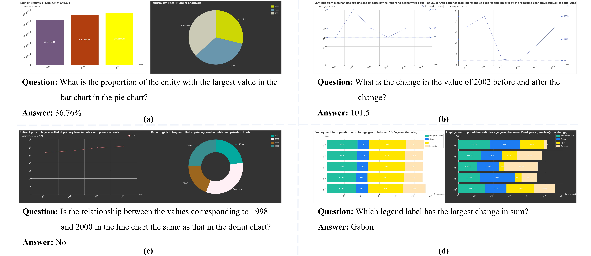

# MCQA
[Charting the Uncharted: Building and Analyzing a Multifaceted Chart Question Answerring Dataset for Complex Logical Reasoning Process](#)

The link of the paper will be updated soon.




## Overview

MCQA is a large-scale Multi-chart question answering dataset that emphasizes logical and numerical reasoning. In comparison to previous chart question answering datasets, this dataset innovatively join multiple charts for joint reasoning to uncover deeper correlations and potential viewpoints within the charts. Additionally, the questions in the MCQA dataset necessitate a certain level of ability to understand charts and strong numerical reasoning and calculation skills. The dataset comprises 22,860 generated chart pairs and 100,331 questions that that demand a high degree of reasoning ability and chart understanding.  It has been partitioned into training, validation, and test sets with a ratio of 8:1:1.

For more detailed information, please refer to our [paper](#).


## Access

If you would like to download the MCQA dataset, please send email to lhe@cs.ecnu.edu.cn , lhe@cs.ecnu.edu.cn and lhe@cs.ecnu.edu.cn . We will send you the dataset download link.


## Citation

If you use the MCQA dataset please cite:

```
@article{wu2024ccqa,
  title={Charting the Uncharted: Building and Analyzing a Multifaceted Chart Question Answerring Dataset for Complex Logical Reasoning Process},
  author={Wu, Anran and Yang, Shuwen and Xia, Yujia and Wu, Xingjiao and Ma, Tianlong and He, Liang},
  inproceedings={The 7th Chinese Conference on Pattern Recognition and Computer Vision PRCV 2024},
  year={2024}
}
```
